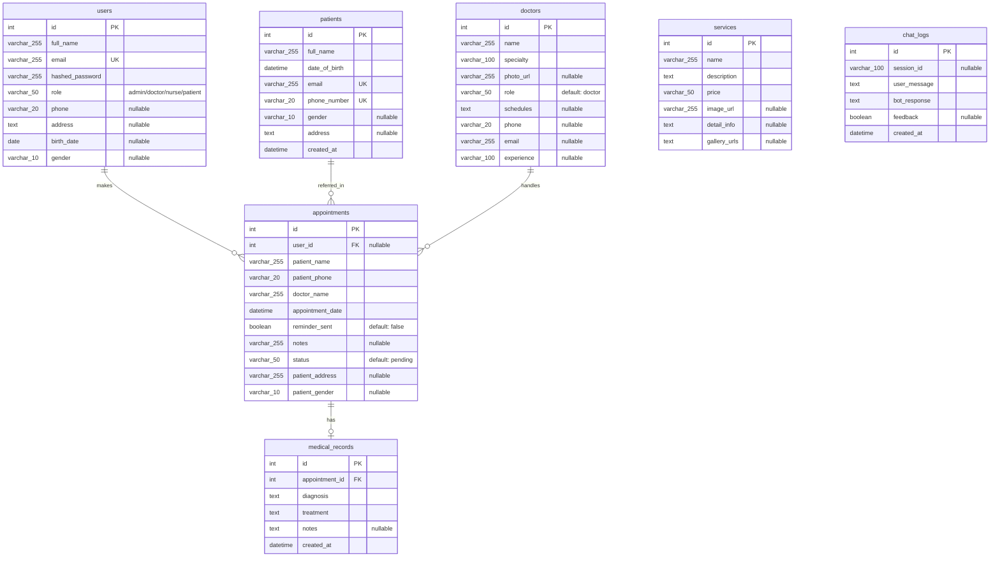

# Entity Relationship Diagram (ERD) - ClinicAi

Dokumen ini memuat rancangan struktur database (Entity Relationship Diagram) untuk ClinicAi, mencakup seluruh entitas, atribut, tipe data, serta hubungan (relasi) fisik maupun konseptual di dalam sistem REST API (FastAPI) dan basis data saat ini.

---

## 1. Visualisasi ERD (Mermaid Diagram)

Berikut adalah visualisasi hubungan antar entitas di dalam database ClinicAi dengan tipe data SQL standar (kompatibel dengan **Visual Paradigm**):

*Catatan: Pada diagram Mermaid di atas, tanda kurung tipe data digantikan dengan garis bawah (misal: `varchar_255` mewakili `VARCHAR(255)`) demi validasi sintaks Mermaid.*

---

## 2. Deskripsi Entitas & Atribut (Standar SQL)

### 2.1. Tabel `users`
Menyimpan akun pengguna yang terdaftar untuk keperluan autentikasi dan otorisasi (RBAC).

| Nama Kolom | Tipe Data SQL | Keterangan |
| :--- | :--- | :--- |
| `id` | `INT` / `INTEGER` | Primary Key, Auto-increment. |
| `full_name` | `VARCHAR(255)` | Nama lengkap pengguna. |
| `email` | `VARCHAR(255)` | Email pengguna (Unique, untuk login). |
| `hashed_password` | `VARCHAR(255)` | Password yang telah di-hash (keamanan). |
| `role` | `VARCHAR(50)` | Hak akses pengguna (`admin`, `doctor`, `nurse`, `patient`). |
| `phone` | `VARCHAR(20)` | Nomor telepon pengguna (Nullable). |
| `address` | `TEXT` | Alamat lengkap pengguna (Nullable). |
| `birth_date` | `DATE` | Tanggal lahir pengguna (Nullable). |
| `gender` | `VARCHAR(10)` | Jenis kelamin pengguna (Nullable). |

### 2.2. Tabel `patients`
Menyimpan data biodata lengkap pasien yang terdaftar di klinik.

| Nama Kolom | Tipe Data SQL | Keterangan |
| :--- | :--- | :--- |
| `id` | `INT` / `INTEGER` | Primary Key, Auto-increment. |
| `full_name` | `VARCHAR(255)` | Nama lengkap pasien. |
| `date_of_birth` | `DATETIME` | Tanggal lahir pasien. |
| `email` | `VARCHAR(255)` | Email pasien (Unique). |
| `phone_number` | `VARCHAR(20)` | Nomor telepon aktif pasien (Unique). |
| `gender` | `VARCHAR(10)` | Jenis kelamin pasien (Nullable). |
| `address` | `TEXT` | Alamat lengkap pasien (Nullable). |
| `created_at` | `DATETIME` | Waktu pembuatan record pasien. |

### 2.3. Tabel `doctors`
Menyimpan data profil dokter dan jadwal praktik mereka.

| Nama Kolom | Tipe Data SQL | Keterangan |
| :--- | :--- | :--- |
| `id` | `INT` / `INTEGER` | Primary Key, Auto-increment. |
| `name` | `VARCHAR(255)` | Nama lengkap dokter. |
| `specialty` | `VARCHAR(100)` | Spesialisasi dokter (misal: Gigi, Umum). |
| `photo_url` | `VARCHAR(255)` | Link foto profil dokter (Nullable). |
| `role` | `VARCHAR(50)` | Default: `doctor`. |
| `schedules` | `TEXT` / `JSON` | Jadwal ketersediaan praktik dokter. |
| `phone` | `VARCHAR(20)` | Nomor telepon dokter (Nullable). |
| `email` | `VARCHAR(255)` | Email dokter (Nullable). |
| `experience` | `VARCHAR(100)` | Pengalaman kerja dokter (Nullable). |

### 2.4. Tabel `services`
Menyimpan jenis layanan/tindakan klinik beserta harga dan informasinya.

| Nama Kolom | Tipe Data SQL | Keterangan |
| :--- | :--- | :--- |
| `id` | `INT` / `INTEGER` | Primary Key, Auto-increment. |
| `name` | `VARCHAR(255)` | Nama layanan klinik. |
| `description` | `TEXT` | Deskripsi singkat layanan. |
| `price` | `VARCHAR(50)` | Tarif layanan. |
| `image_url` | `VARCHAR(255)` | URL gambar ilustrasi layanan (Nullable). |
| `detail_info` | `TEXT` | Detail informasi layanan (Nullable). |
| `gallery_urls` | `TEXT` / `JSON` | List URL foto galeri layanan (Nullable). |

### 2.5. Tabel `appointments`
Menyimpan data pendaftaran/reservasi janji temu pasien dengan dokter.

| Nama Kolom | Tipe Data SQL | Keterangan |
| :--- | :--- | :--- |
| `id` | `INT` / `INTEGER` | Primary Key, Auto-increment. |
| `user_id` | `INT` / `INTEGER` | Foreign Key ke `users.id` (Nullable). |
| `patient_name` | `VARCHAR(255)` | Nama pasien yang didaftarkan. |
| `patient_phone` | `VARCHAR(20)` | Nomor telepon pasien. |
| `doctor_name` | `VARCHAR(255)` | Nama dokter yang dipilih. |
| `appointment_date`| `DATETIME` | Tanggal dan waktu janji temu. |
| `reminder_sent` | `BOOLEAN` | Flag apakah notifikasi pengingat sudah dikirim. |
| `notes` | `VARCHAR(255)` | Catatan/keluhan awal pasien (Nullable). |
| `status` | `VARCHAR(50)` | Status janji temu (`pending`, `confirmed`, `completed`, `cancelled`). |
| `patient_address`| `VARCHAR(255)` | Alamat pasien saat mendaftar (Nullable). |
| `patient_gender` | `VARCHAR(10)` | Jenis kelamin pasien saat mendaftar (Nullable). |

### 2.6. Tabel `medical_records`
Menyimpan riwayat diagnosis dan resep obat yang diisi oleh dokter setelah pemeriksaan.

| Nama Kolom | Tipe Data SQL | Keterangan |
| :--- | :--- | :--- |
| `id` | `INT` / `INTEGER` | Primary Key, Auto-increment. |
| `appointment_id` | `INT` / `INTEGER` | Foreign Key ke `appointments.id`. |
| `diagnosis` | `TEXT` | Diagnosis penyakit dari dokter. |
| `treatment` | `TEXT` | Tindakan/terapi/resep obat yang diberikan. |
| `notes` | `TEXT` | Catatan tambahan medis (Nullable). |
| `created_at` | `DATETIME` | Waktu penyimpanan rekam medis. |

### 2.7. Tabel `chat_logs`
Menyimpan log percakapan antara pasien dengan AI chatbot serta feedback kepuasan.

| Nama Kolom | Tipe Data SQL | Keterangan |
| :--- | :--- | :--- |
| `id` | `INT` / `INTEGER` | Primary Key, Auto-increment. |
| `session_id` | `VARCHAR(100)` | ID Sesi chat (Nullable). |
| `user_message` | `TEXT` | Pesan/pertanyaan yang dikirim pasien. |
| `bot_response` | `TEXT` | Jawaban/tanggapan dari model AI. |
| `feedback` | `BOOLEAN` | Feedback pengguna (`True` = Suka, `False` = Tidak Suka). |
| `created_at` | `DATETIME` | Waktu interaksi terjadi. |

---

## 3. Penjelasan Relasi (Relationships)

### 3.1. Relasi Fisik (Database Foreign Keys)
1. **`users` -> `appointments` (One-to-Many):**
   - Diwakili oleh `appointments.user_id` yang merujuk ke `users.id`.
   - Satu pengguna (dengan role `patient`) dapat membuat banyak janji temu (`appointments`). Hubungan bersifat nullable karena pasien luar/tanpa akun bisa didaftarkan langsung.
2. **`appointments` -> `medical_records` (One-to-One / One-to-Many):**
   - Diwakili oleh `medical_records.appointment_id` yang merujuk ke `appointments.id`.
   - Satu janji temu (`appointment`) menghasilkan tepat satu rekam medis (`medical_record`) setelah statusnya diselesaikan (`completed`).

### 3.2. Relasi Logis / Konseptual (Aplikasi)
1. **`patients` -> `appointments` (Logical):**
   - Secara konseptual, data pasien dihubungkan dengan janji temu berdasarkan keunikan data email (`patients.email` -> `users.email`) dan nama pasien (`patients.full_name` -> `appointments.patient_name`).
2. **`doctors` -> `appointments` (Logical):**
   - Dokter dihubungkan dengan janji temu melalui pencocokan nama string (`doctors.name` -> `appointments.doctor_name`) pada level API/Query untuk memfilter antrean masing-masing dokter.
