# Sequence Diagrams - ClinicAi

Dokumen ini memuat Sequence Diagram lengkap untuk setiap Use Case yang ada pada rancangan sistem ClinicAi, disesuaikan dengan arsitektur REST API (FastAPI) dan Frontend (Next.js) yang ada pada sistem informasi saat ini.

---

    ## 1. Autentikasi (Umum untuk Semua Aktor)

    ### 1.1 Login (termasuk *Verifikasi Akun*)
    ```mermaid
    sequenceDiagram
        participant A as Aktor (User/Dokter/Admin/Perawat)
        participant UI as Frontend
        participant API as Backend (auth.py)
        participant DB as Database
        A->>UI: Input Email & Password
        UI->>API: POST /login
        API->>DB: Cek Email User
        DB-->>API: Data User & Password Hash
        API->>API: Verifikasi Password Hash
        alt Kredensial Valid
            API-->>UI: Return Access Token (JWT)
            UI->>API: GET /me (mengambil role & data user)
            API-->>UI: Return Data User
            UI-->>A: Redirect ke Dashboard Sesuai Role
        else Kredensial Invalid
            API-->>UI: 401 Unauthorized
            UI-->>A: Tampilkan Pesan Error
        end
    ```

### 1.2 Logout
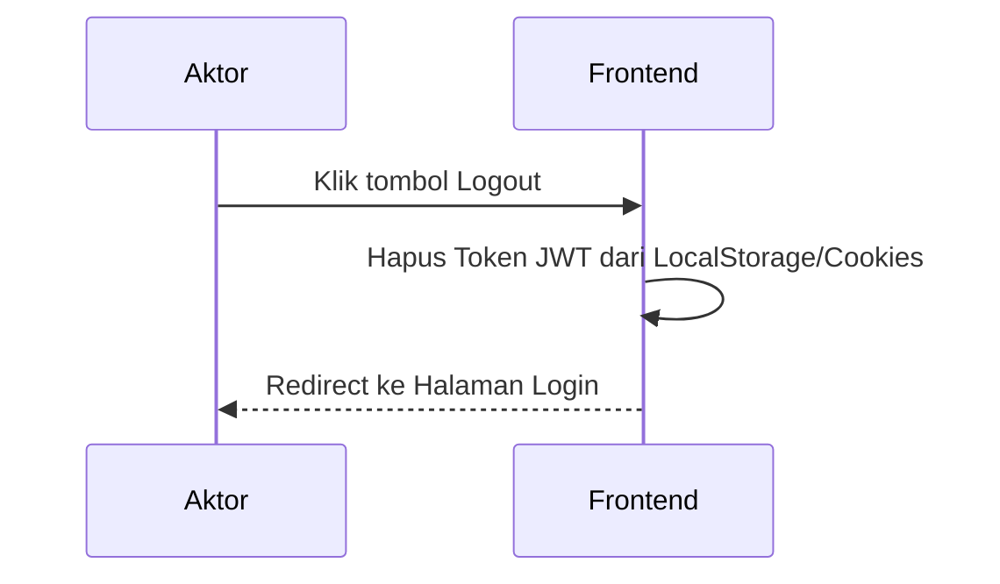

---

## 2. User / Pasien

### 2.1 Melihat Dashboard
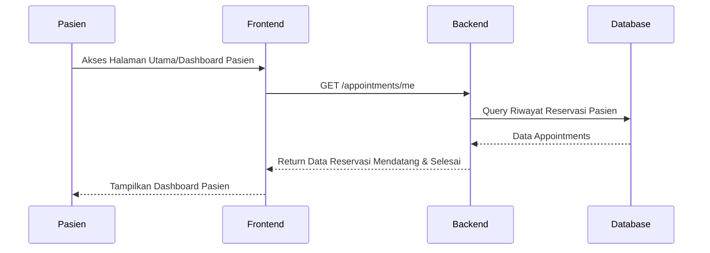

### 2.2 Membuat Janji Temu
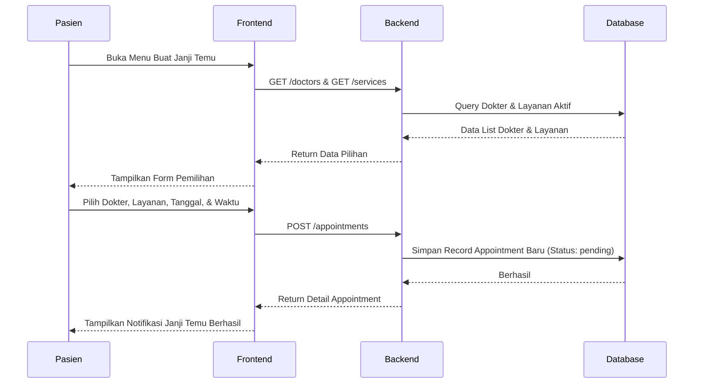

### 2.3 Melihat Jadwal Dokter
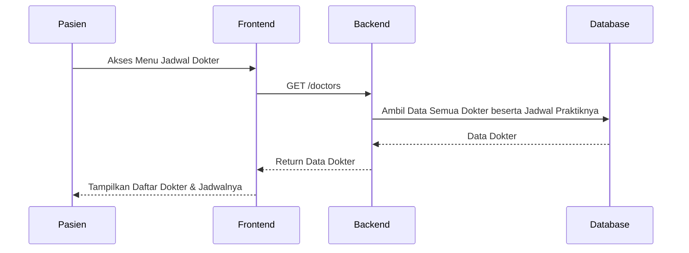

### 2.4 Melihat Layanan Klinik
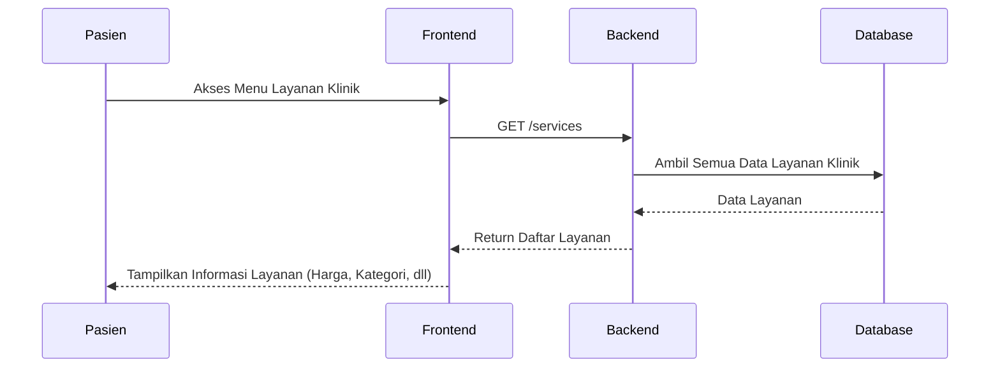

### 2.5 Chat AI / Klinik AI
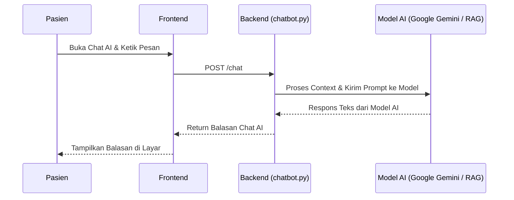

### 2.6 Mengelola Profil (Pasien)
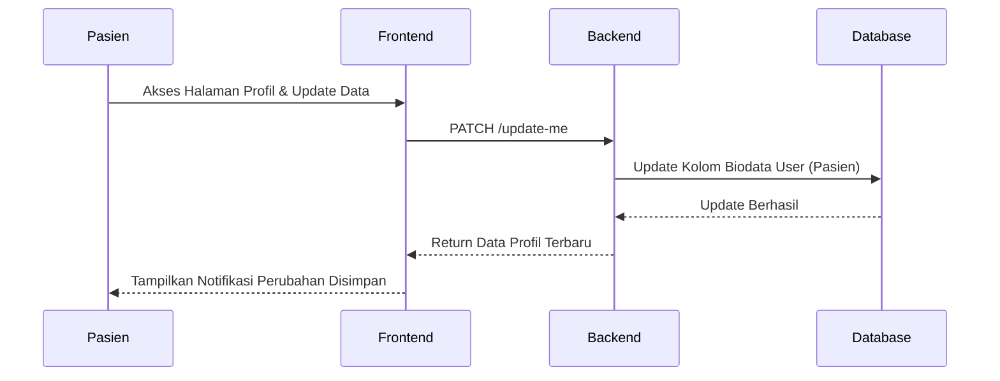

---

## 3. Dokter

### 3.1 Melihat Jadwal Praktik
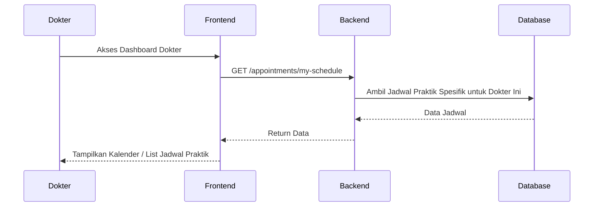

### 3.2 Melihat Data Penyakit Pasien
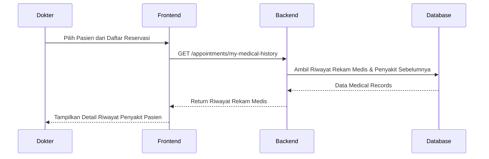

### 3.3 Mengisi Rekam Medis & 3.4 Memberikan Diagnosis
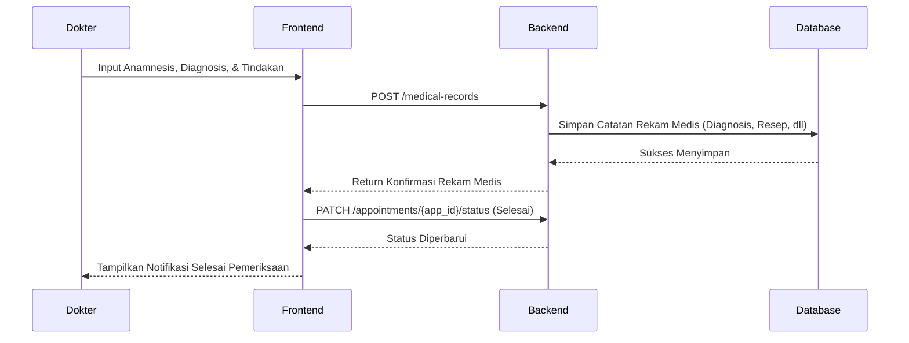

### 3.5 Melihat Reservasi Pasien
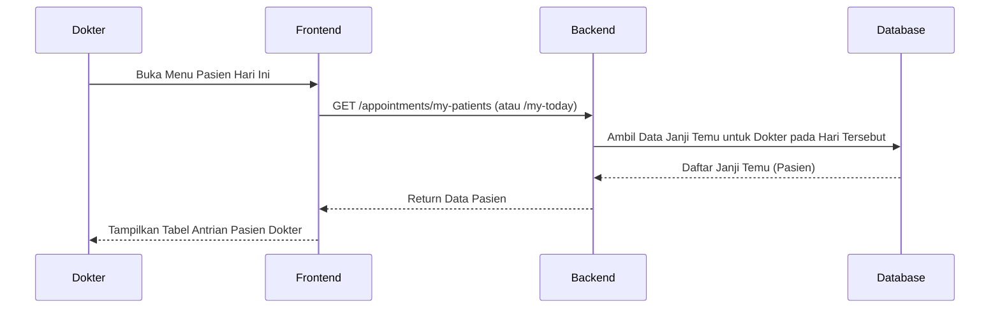

### 3.6 Mengelola Profil (Dokter)
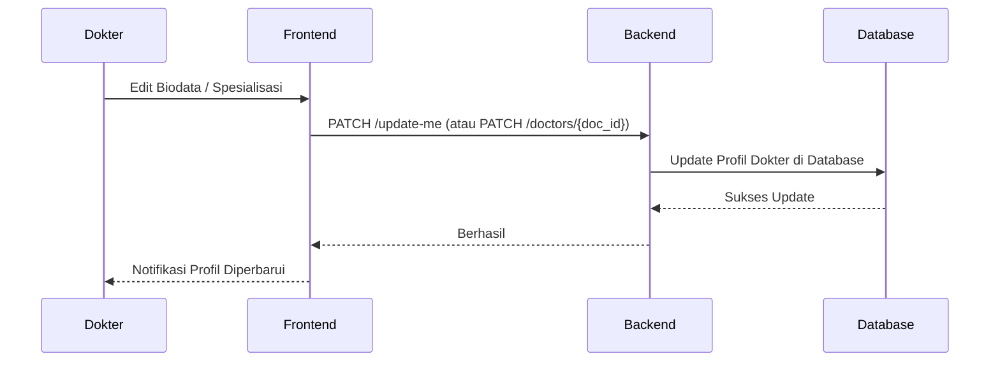

---

## 4. Admin

### 4.1 Mengelola Data Pasien
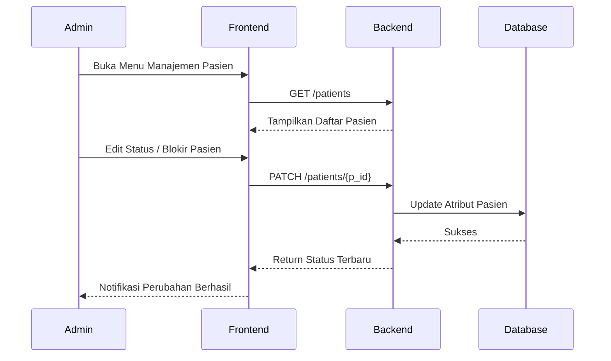

### 4.2 Mengelola Data Dokter & 4.3 Mengelola Jadwal Dokter
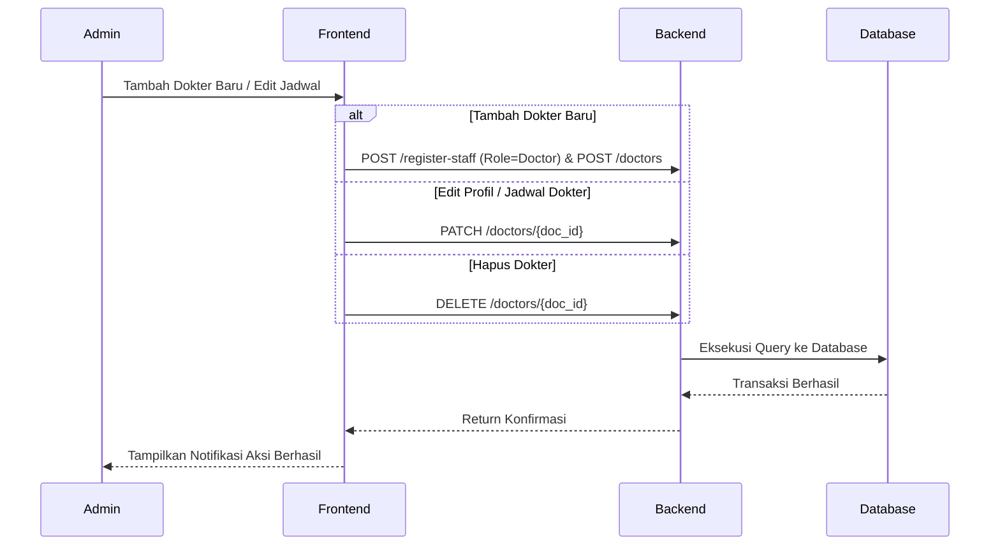

### 4.4 Mengelola Reservasi
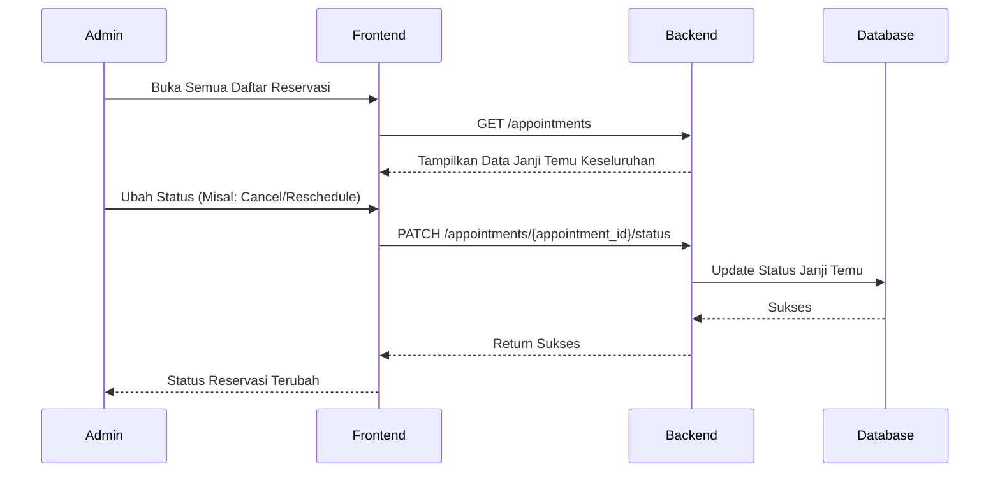

### 4.5 Mengelola Layanan Klinik
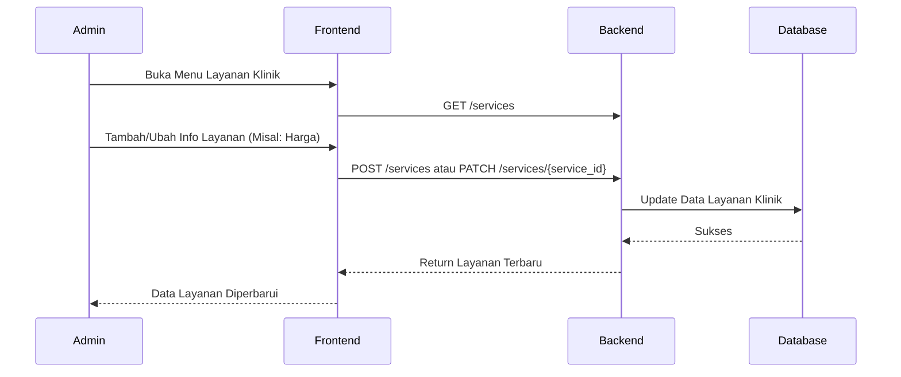

### 4.6 Mengelola AI Knowledge
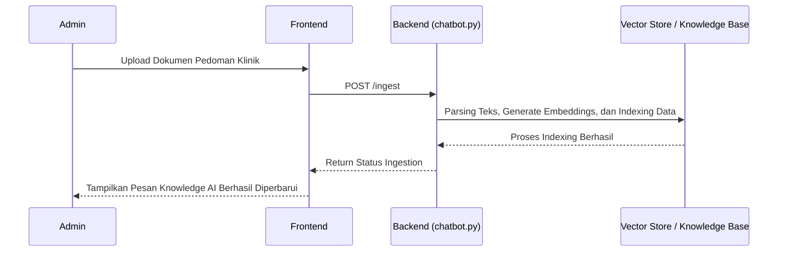

### 4.7 Monitoring Dashboard
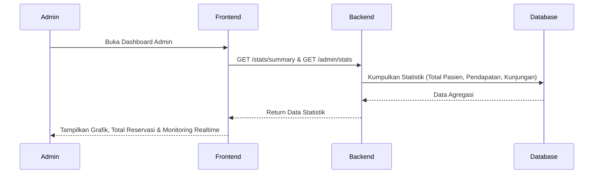

### 4.8 Verifikasi Administrator & 4.9 Mengelola Pengaturan Sistem
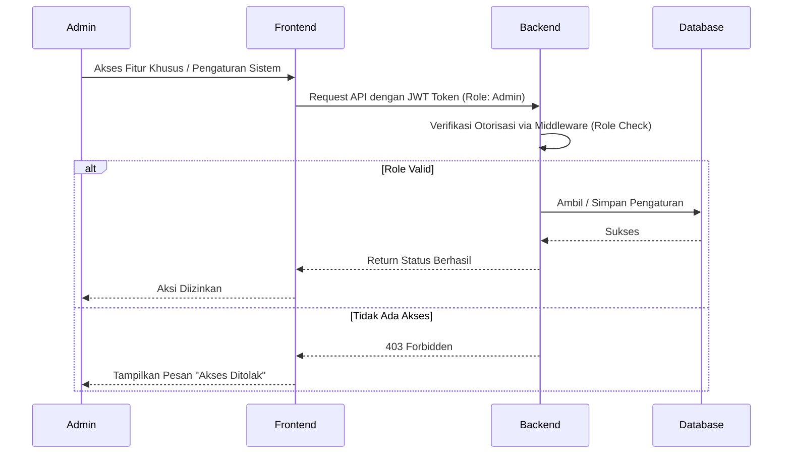

---

## 5. Perawat

### 5.1 Melihat Antrian Pasien
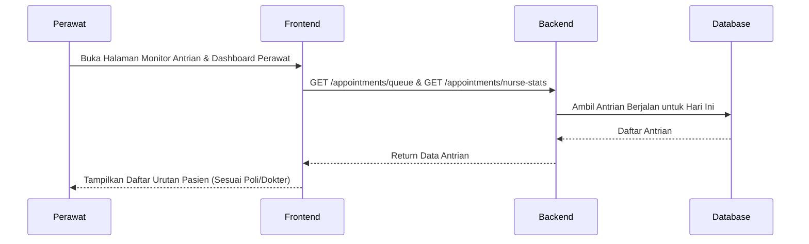

### 5.2 Memanggil Pasien & 5.5 Membantu Pelayanan Klinik
```mermaid
sequenceDiagram
    participant Pr as Perawat
    participant UI as Frontend
    participant API as Backend
    participant DB as Database
    Pr->>UI: Klik tombol "Panggil / Proses" Pasien
    UI->>API: PATCH /appointments/{appointment_id}/status (Status: "in-progress")
    API->>DB: Update Status Antrian
    DB-->>API: Berhasil Diupdate
    API-->>UI: Return Status Terbaru
    UI-->>Pr: Pasien Ditandai Sedang Dilayani
```

### 5.3 Mengelola Catatan Medis & 5.4 Melihat Data Pasien
```mermaid
sequenceDiagram
    participant Pr as Perawat
    participant UI as Frontend
    participant API as Backend
    participant DB as Database
    Pr->>UI: Buka Detail Pasien & Input Pemeriksaan Awal (Tensi, Suhu)
    UI->>API: GET /patients/{id} (Lihat Info)
    API-->>UI: Info Biodata Pasien
    UI->>API: POST /medical-records (Catatan Perawat)
    API->>DB: Simpan Tanda-tanda Vital Pra-Pemeriksaan
    DB-->>API: Sukses
    API-->>UI: Return Data Tersimpan
    UI-->>Pr: Tampilkan Notifikasi Pemeriksaan Awal Disimpan
```

### 5.6 Mengelola Profil (Perawat)
```mermaid
sequenceDiagram
    participant Pr as Perawat
    participant UI as Frontend
    participant API as Backend
    participant DB as Database
    Pr->>UI: Buka Pengaturan Akun
    UI->>API: PATCH /update-me
    API->>DB: Update Data Akun Perawat
    DB-->>API: Sukses
    API-->>UI: Return Profil Terbaru
    UI-->>Pr: Notifikasi Update Profil Berhasil
```
